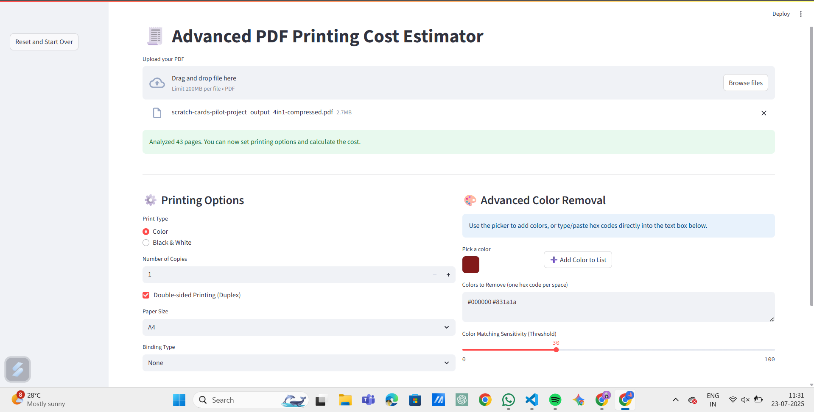
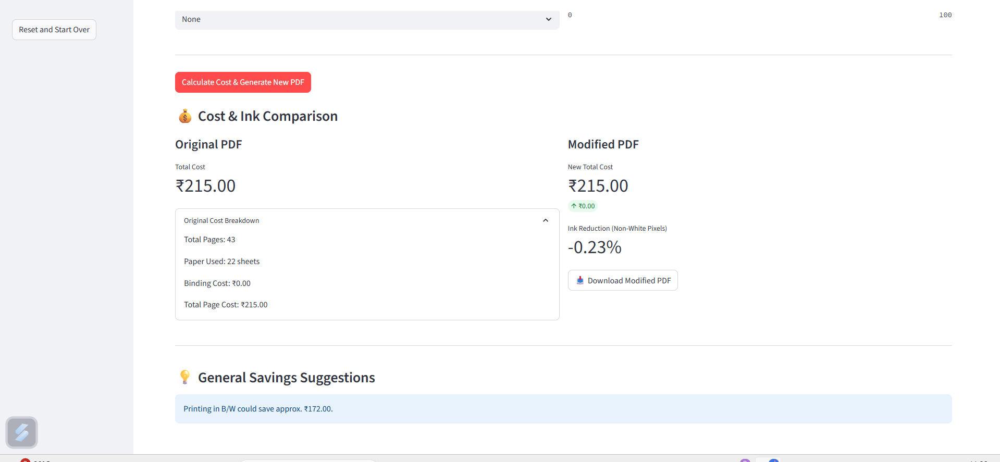

# 🧾 Advanced PDF Printing Cost Estimator

[](https://streamlit.io/)

An interactive web application built with Streamlit to analyze PDF files, estimate printing costs, and provide tools to reduce costs by selectively removing colors.

This tool goes beyond simple page counting by analyzing the pixel data of each page to differentiate between black & white, low-color, and high-color pages, providing a more accurate cost estimate.

---

## ✨ Features

- **Detailed Cost Breakdown**: Get estimates based on print type (color/B&W), paper size (A4/A3), duplex printing, binding, and number of copies.
- **Intelligent Color Analysis**: Automatically detects the amount of color on each page to provide a tiered cost structure.
- **Advanced Color Removal**:
  - Use an interactive **color picker** to visually select specific colors to remove.
  - Manually input a list of hex codes for precise color removal.
  - Adjust the **sensitivity threshold** to control how closely a pixel must match to be removed.
- **Cost & Ink Comparison**: Instantly see a side-by-side comparison of the original vs. modified PDF, including total cost savings and percentage reduction in "ink".
- **PDF Regeneration**: Download a new, optimized PDF with the selected colors removed.
- **Actionable Suggestions**: Receive tips on how to further reduce costs.

---

## 📸 Screenshots

### 🔧 Main Interface
<p align="center">
  
  <br><em>Main interface showing printing options and color removal tools.</em>
</p>

### 📊 Cost & Ink Comparison
<p align="center">
  
  <br><em>Cost and ink comparison between the original and modified PDF.</em>
</p>

---

## 🚀 How to Run Locally

### 1. Prerequisites

- **Python**: Version 3.8 or higher
- **Poppler**: Required by `pdf2image`

#### Install Poppler:

- **macOS (using Homebrew)**:
  ```bash
  brew install poppler
  ```
- **Ubuntu/Debian**:
  ```bash
  sudo apt-get update && sudo apt-get install -y poppler-utils
  ```
- **Windows**:
  - Download from [http://blog.alivate.com.au/poppler-windows/](http://blog.alivate.com.au/poppler-windows/)
  - Extract it and add the `bin/` folder to your System PATH

---

### 2. Clone the Repository

```bash
git clone https://github.com/your-username/python_streamlit_print_cost_reducer.git
cd python_streamlit_print_cost_reducer
```

---

### 3. Install Dependencies

Create a virtual environment and install packages:

```bash
# Create virtual environment
python -m venv venv

# Activate it
# For Windows:
venv\Scripts\activate
# For macOS/Linux:
source venv/bin/activate

# Install dependencies
pip install -r requirements.txt
```

#### `requirements.txt` content:

```txt
streamlit
pdf2image
Pillow
numpy
```

---

### 4. Run the App

```bash
streamlit run app.py
```

Your browser will open with the app running at `http://localhost:8501`.

---

## 🛠️ Technology Stack

- **Frontend & Backend**: [Streamlit](https://streamlit.io/)
- **PDF to Image Conversion**: [pdf2image](https://github.com/Belval/pdf2image)
- **Image Processing**: [Pillow](https://python-pillow.org/)
- **Numerical Computations**: [NumPy](https://numpy.org/)

---

## 📜 License

This project is licensed under the MIT License. See the [LICENSE](./LICENSE) file for more details.
